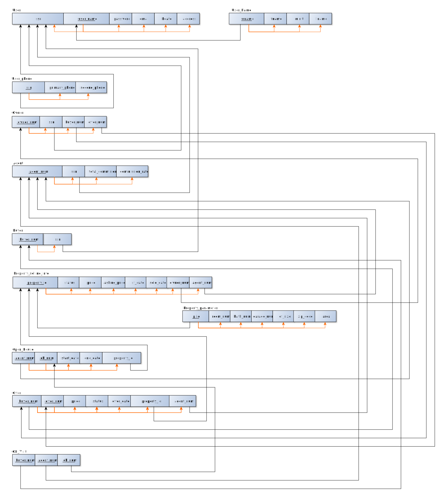

## Functional Dependencies

In relational schema, black lines show inter-relation dependency (FK restriction). Orange lines show FDs.

## Normalization requirements (to 3NF)

* 1st Normal Form (1NF): has PK and all non-PK attrs must depend on PK
    * No multi-valued attr and no nested relation

* 2nd Normal Form (2NF): 1NF + All non-key attrs must be fully FD on PK
    * No partial dependencies. A partial dependency exists when a column is fully dependent on a part of a composite PK

* 3rd Normal Form (3NF): 2NF + All non-key attrs must be directly FD on PK
    * No transitive dependencies

### 1. Original

1. User

```
ssn -> {user_name, password, fname, minit, Lname, bdate, address, email}
```

2. User_phone

```
ssn -> phone
```

3. Owner

```
owner_num -> {ssn, buyer_num, offer_num}
```

4. Agent

```
agent_num -> {ssn, total_commision, commision_date}
```

5. Buyer

```
buyer_num -> ssn
```

6. Property

```
property_id -> {status, price, asking_price......}
```

7. Open_House

```
{agent_num, oh_num} -> {start_date, end_date, property_id}
```

8. Offer

```
{buyer_num, offer_num} -> {price, status,offer_date, property_id, agent_num}
```

9. OH_visit

```
buyer_num -> {agent_num, oh_num}
```

### 2. Before normalization

1. Divide 'User' to 'user' (1.1) and 'User_name' (1.2).

```
ssn -> {user_name, password, email, bdate, address}
```

```
Uname -> {fname, minit, Lname}
```

6. Divide 'Property' to 'Property_selling_info' (6.1) and 'Property_parameter' (6.2).

```
property_id -> {status, price, asking_price, list_date, sold_date, owner_num, agent_num}
```

```
p_id-> {room_num, bath_num, garage_num, lot_size, zip_code, area}
```

### 3. 1NF

1. (in 1.1) Change PK to 'user_name'. Let 'ssn' depend on 'user_name'. 

2. 'phone' may have multiple value, changed to 'primary_phone', 'second_phone'.

```
ssn -> {primary_phone, second_phone}
```

### 4. 2NF

All relations have already been 2NF.

### 5. 3NF

All relations have already been 3NF.

## Schema

### 1. Original


### 2. 3NF

